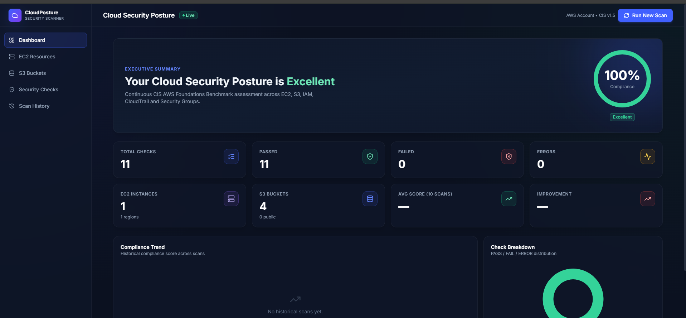
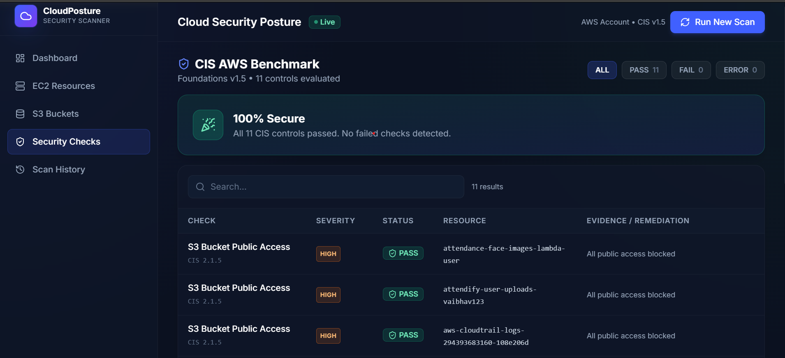
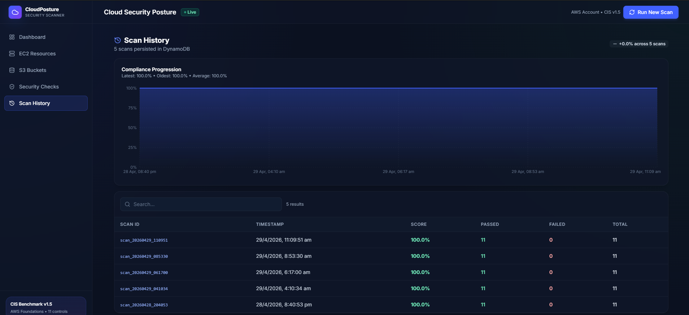

# ☁️ CloudPosture Security Scanner

### Production-style AWS Cloud Security Posture Management Platform

     

**Real-time CIS Benchmark scanning • Multi-region EC2 + S3 discovery • Compliance analytics • DynamoDB history**

[Quick Start](#-quick-start) · [Architecture](#-architecture) · [API Reference](#-api-endpoints) 

---

## 📸 Dashboard Preview


Dashboard

 

Security Checks  

  

Scan History 

 


---

## 🎯 What Is This?

CloudPosture continuously scans your AWS environment against the **CIS AWS Foundations Benchmark v1.5** and surfaces risks through an interactive security dashboard.

It's a production-style SaaS-ready CSPM platform — real AWS API calls, real misconfigurations detected, real remediation guidance.

---

## 🏆 Key Achievements

| | |
|---|---|
| ✅ 11 CIS security checks implemented | ✅ Multi-region EC2 scanning (17 regions, parallel) |
| ✅ 20s → 3s scan time via ThreadPoolExecutor | ✅ DynamoDB-backed scan history + trend analytics |
| ✅ Full-stack FastAPI + React + TypeScript | ✅ 5-min in-memory TTL cache layer |

---

## ✨ Features

**Dashboard** — Compliance score ring, executive verdict, stat cards, trend chart, pass/fail/error distribution

**EC2 Resources** — Multi-region instance discovery with metadata, state badges, sortable table, intelligent caching

**S3 Buckets** — Encryption status, public access flags, versioning, color-coded risk badges

**Security Checks** — Per-check CIS results with severity, evidence, and actionable remediation guidance

**Scan History** — Historical compliance scores, improvement delta, trend visualization

---

## 🛡 CIS Benchmark Coverage

| Check ID | Control | Severity |
|----------|---------|----------|
| CIS 1.5 | Root Account MFA | 🔴 Critical |
| CIS 2.1.1 | S3 Bucket Encryption | 🟠 High |
| CIS 2.1.5 | S3 Public Access Block | 🟠 High |
| CIS 3.1 | CloudTrail Enabled | 🟠 High |
| CIS 5.2 | No Unrestricted SSH (port 22) | 🔴 Critical |
| CIS 5.3 | No Unrestricted RDP (port 3389) | 🔴 Critical |

---

## 🏗 Architecture

```
BROWSER (Port 5173)
  Dashboard · EC2 · S3 · Security Checks · History
         │ Axios HTTP
         ▼
FastAPI Backend (Port 8000)
  In-Memory Cache (5 min TTL)
         │ Cache MISS
         ▼
Scanner Modules (Boto3)
  EC2 Scanner (parallel regions)
  S3 Scanner
  CIS Checks Engine (IAM · S3 · EC2 · CloudTrail · SG)
         │
         ▼
AWS Cloud
  EC2 API · S3 API · IAM API · CloudTrail API
  DynamoDB (CloudPostureResults table)
```

**End-to-end flow:** User triggers scan → FastAPI clears cache → Boto3 hits live AWS APIs → results scored + saved to DynamoDB → JSON response → dashboard refresh with toast notification.

---

## 🛠 Tech Stack

**Backend:** Python 3.11 · FastAPI 0.104 · Uvicorn · Boto3 · ThreadPoolExecutor · python-dotenv

**Frontend:** React 19 · TypeScript 6.0 · Vite 8.0 · Tailwind CSS 3.4 · Recharts · Axios · React Router · Lucide React

**Cloud:** AWS EC2 · S3 · IAM · CloudTrail · DynamoDB

---

## 🚀 Quick Start

### Prerequisites
- Python 3.11+ and Node.js 20+
- AWS account with programmatic access (`aws configure`)

### Required IAM Permissions

```json
{
  "Effect": "Allow",
  "Action": [
    "ec2:DescribeInstances", "ec2:DescribeRegions", "ec2:DescribeSecurityGroups",
    "s3:ListAllMyBuckets", "s3:GetBucketEncryption", "s3:GetBucketPublicAccessBlock",
    "s3:GetBucketVersioning", "s3:GetBucketLocation",
    "iam:GetAccountSummary",
    "cloudtrail:DescribeTrails", "cloudtrail:GetTrailStatus",
    "dynamodb:PutItem", "dynamodb:GetItem", "dynamodb:Scan", "dynamodb:Query"
  ],
  "Resource": "*"
}
```

### 1. Clone

```bash
git clone https://github.com/vaibhavk0411/CloudPosture.git
cd CloudPosture
```

### 2. Backend

```bash
cd backend
python -m venv venv && source venv/bin/activate  # Windows: .\venv\Scripts\Activate.ps1
pip install -r requirements.txt
cp .env.example .env
uvicorn main:app --reload
# → http://localhost:8000
```

### 3. Frontend

```bash
cd frontend
npm install
cp .env.example .env.local
npm run dev
# → http://localhost:5173
```

### 4. Create DynamoDB table

```bash
aws dynamodb create-table \
  --table-name CloudPostureResults \
  --attribute-definitions AttributeName=scan_id,AttributeType=S \
  --key-schema AttributeName=scan_id,KeyType=HASH \
  --billing-mode PAY_PER_REQUEST \
  --region us-east-1
```

### 5. Run your first scan

```bash
curl -X POST http://localhost:8000/scan
open http://localhost:5173
```

---

## 🔌 API Endpoints

### Core Scanning

| Method | Endpoint | Description |
|--------|----------|-------------|
| `POST` | `/scan` | Run full posture scan + save to DynamoDB |
| `GET` | `/instances` | EC2 instances across all regions (5 min cache) |
| `GET` | `/buckets` | S3 buckets with security metadata (5 min cache) |
| `GET` | `/cis-results` | CIS compliance check results (5 min cache) |

### Analytics & History

| Method | Endpoint | Description |
|--------|----------|-------------|
| `GET` | `/summary` | Latest scan summary |
| `GET` | `/failed-checks` | Failed checks from latest scan |
| `GET` | `/trend?limit=N` | Compliance score trend (last N scans) |
| `GET` | `/scans?limit=N` | All historical scan records |
| `GET` | `/docs` | Swagger UI (auto-generated) |

<details>
<summary>Example response — <code>GET /cis-results</code></summary>

```json
{
  "summary": {
    "total_checks": 11,
    "passed": 11,
    "failed": 0,
    "errors": 0,
    "compliance_score": 100.0
  },
  "checks": [
    {
      "check_name": "S3 Bucket Public Access",
      "cis_id": "CIS 2.1.5",
      "severity": "HIGH",
      "status": "PASS",
      "resource": "my-app-bucket",
      "evidence": "All public access blocked",
      "remediation": "Enable S3 Block Public Access at the account level..."
    }
  ]
}
```
</details>

---

## 📁 Folder Structure

```
CloudPosture/
├── backend/
│   ├── main.py              # FastAPI app, routes, caching layer
│   ├── requirements.txt
│   └── scanner/
│       ├── ec2_scanner.py   # Parallel multi-region EC2 discovery
│       ├── s3_scanner.py    # S3 security metadata scanner
│       └── cis_checks.py    # CIS Benchmark compliance engine
│   └── db/
│       └── dynamodb.py      # DynamoDB CRUD + trend analytics
│
└── frontend/
    └── src/
        ├── pages/           # Dashboard, EC2, S3, SecurityChecks, History
        ├── components/      # Charts, tables, layout, UI primitives
        └── services/
            └── api.ts       # Axios client + TypeScript types
```

---

## 🔒 Security Best Practices

| Practice | Implementation |
|----------|---------------|
| No hardcoded credentials | AWS access via `~/.aws/credentials` or IAM roles |
| Read-only AWS access | Scanner only calls `Describe*`, `Get*`, `List*` APIs |
| Environment variables | Sensitive config via `.env` (never committed) |
| Input validation | FastAPI Pydantic models on all API inputs |
| Dependency pinning | `requirements.txt` pins exact versions |

> **Production note:** Replace `allow_origins=["*"]` in `main.py` with your frontend domain, and use IAM roles instead of access keys.

---
 
## 🔮 Future Enhancements
 
- [ ] **PDF Export** — One-click downloadable compliance report
- [ ] **Scheduled Scans** — Cron-based automatic scanning (hourly/daily)
- [ ] **Docker Compose** — One-command local setup
- [ ] **Expanded CIS Controls** — Scale from 6 to full 50+ control set
---
---

## 👨‍💻 Author

**Vaibhav Khandelwal** — Built as a submission for the **Visiblaze Software Engineering Assessment**

[GitHub: vaibhavk0411](https://github.com/vaibhavk0411)
